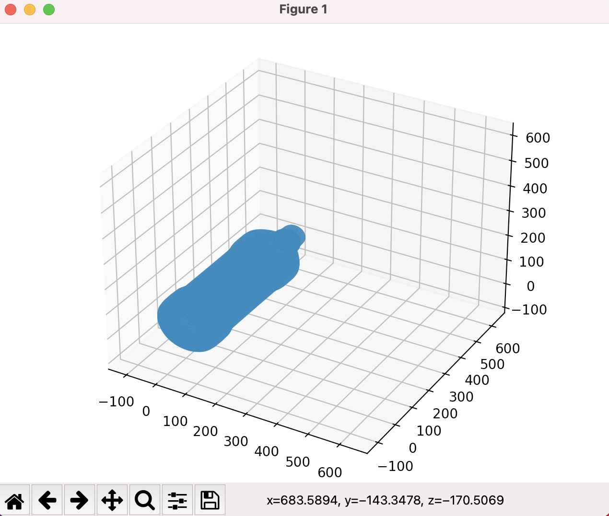
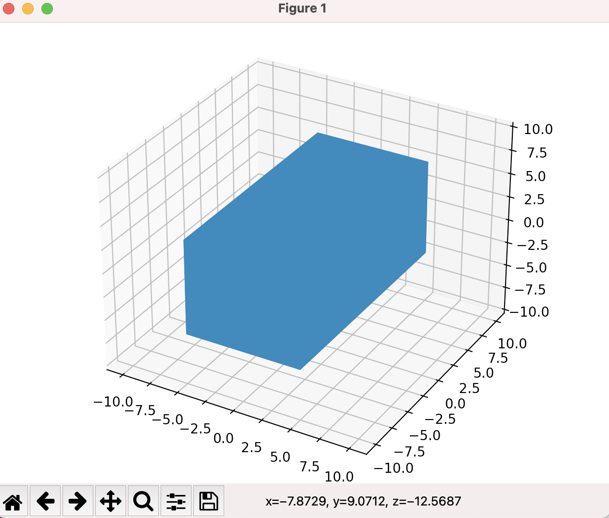
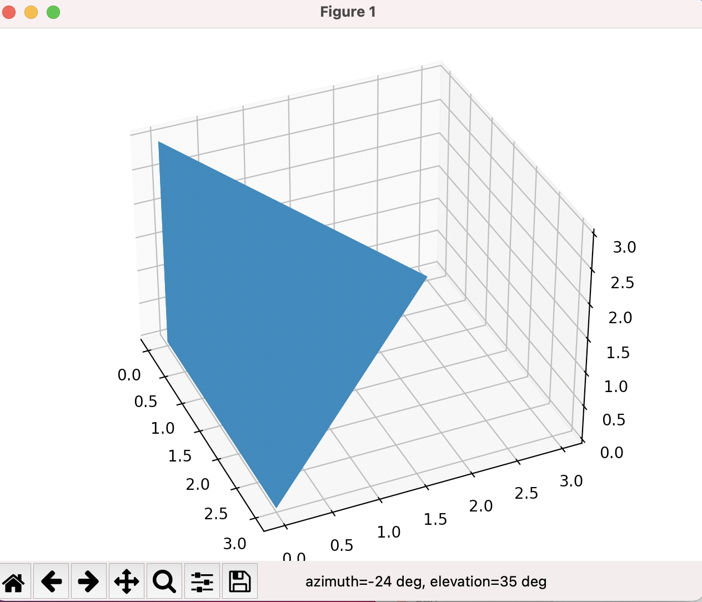
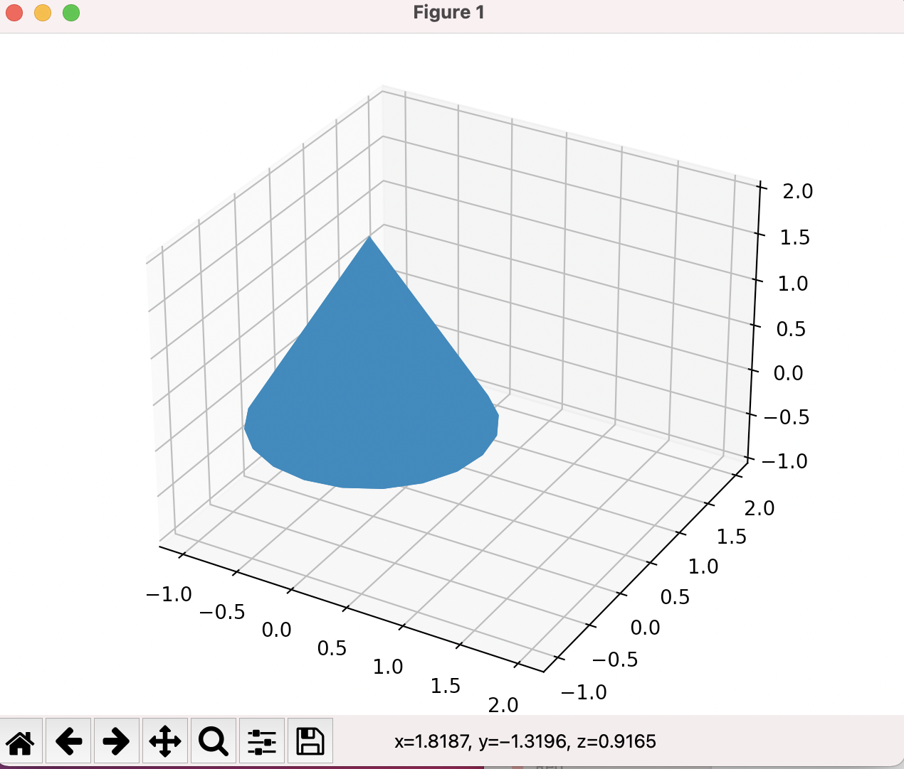
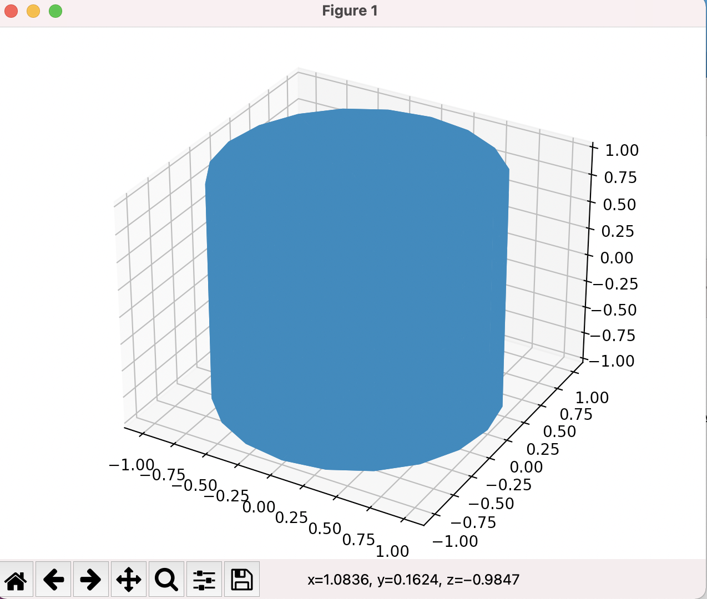

### 環境構築

```
pip3 install -r requirements.txt
```

# ペットボトル



```
重心座標
[-3.65280910e-06  2.70944580e+02  5.64786132e+00]
慣性モーメント
Lx:  [4.73181998e+11 9.04251228e+03 4.48486272e+01]
Ly:  [9.04251228e+03 8.32179518e+10 7.18824682e+04]
Lz:  [4.48486272e+01 7.18824682e+04 4.73181997e+11]
```

# 直方体



```
重心座標
[0. 0. 0.]
慣性モーメント
Lx:  [83333.33333333    -0.            -0.        ]
Ly:  [   -0.         33333.33333333    -0.        ]
Lz:  [   -0.            -0.         83333.33333333]
```

# 三角錐



```
重心座標
[0.75 0.75 0.75]
慣性モーメント
Lx:  [3.0375  0.50625 0.50625]
Ly:  [0.50625 3.0375  0.50625]
Lz:  [0.50625 0.50625 3.0375 ]
```

# 円錐



```
重心座標
[0.         0.         0.50000002]
慣性モーメント
Lx:  [ 0.61299254 -0.         -0.        ]
Ly:  [-0.          0.61299254 -0.        ]
Lz:  [-0.        -0.         0.6079511]
```

# 円柱



```
重心座標
[0. 0. 0.]
慣性モーメント
Lx:  [ 3.57999111 -0.         -0.        ]
Ly:  [-0.          3.57999111 -0.        ]
Lz:  [-0.         -0.          3.03975554]
```